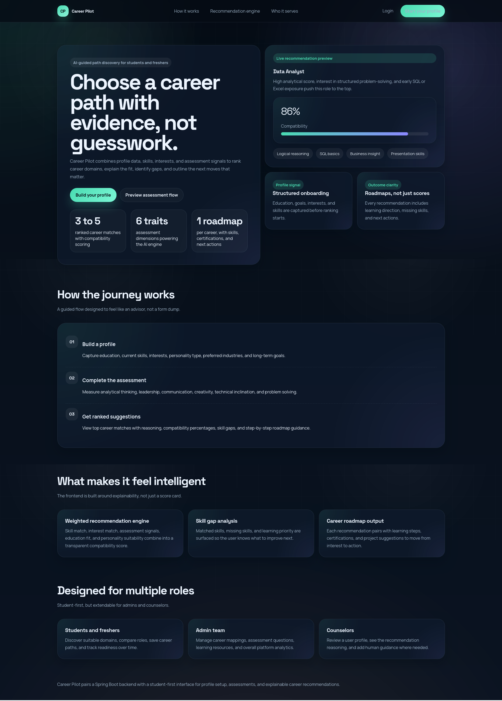
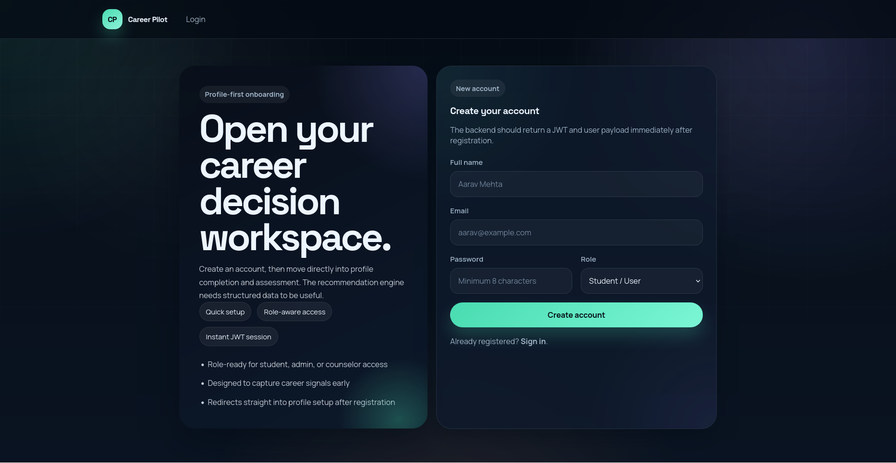
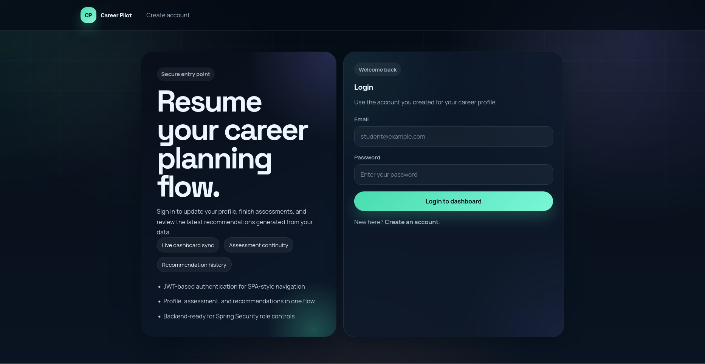
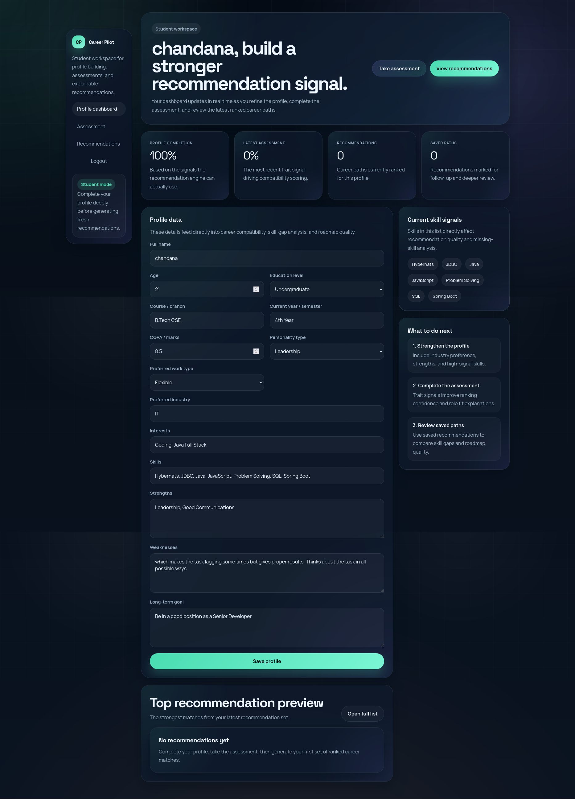
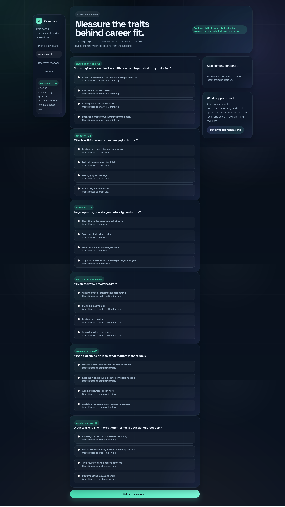
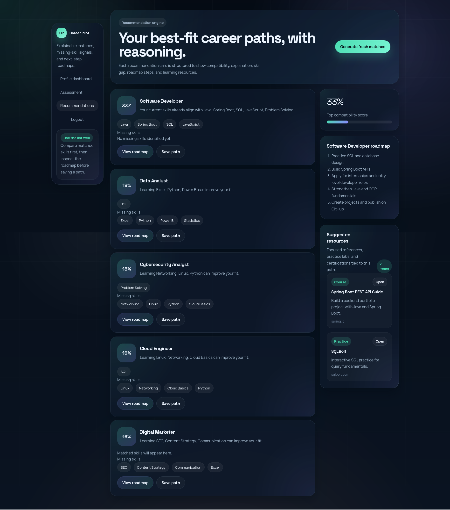
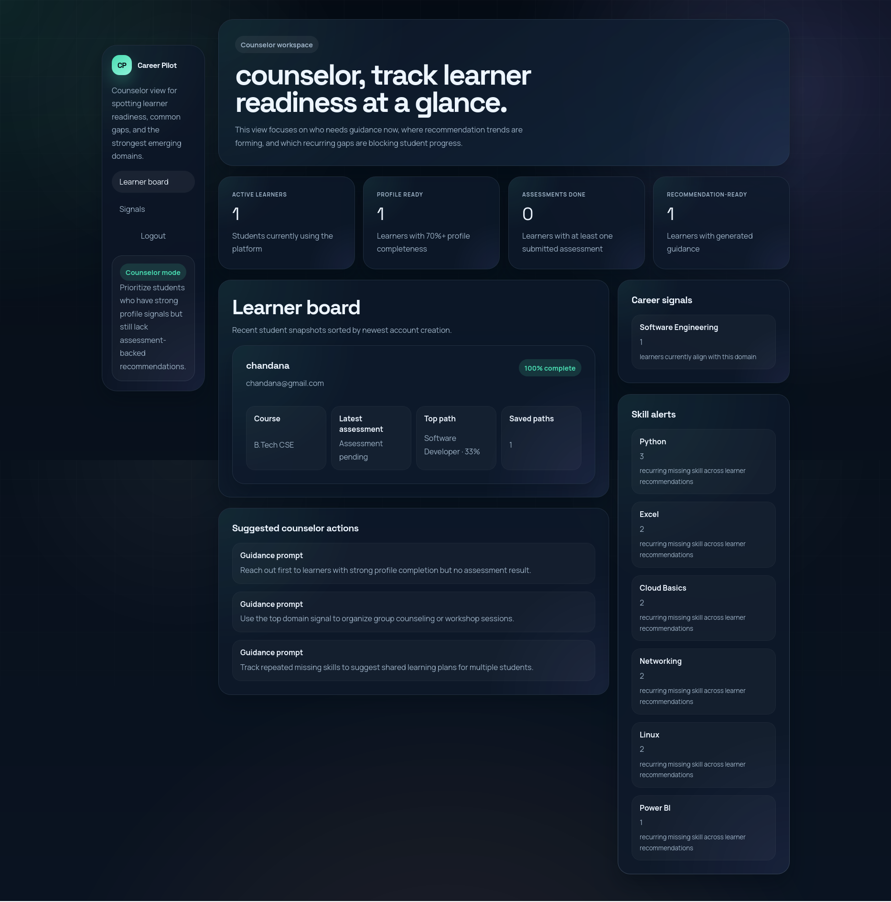
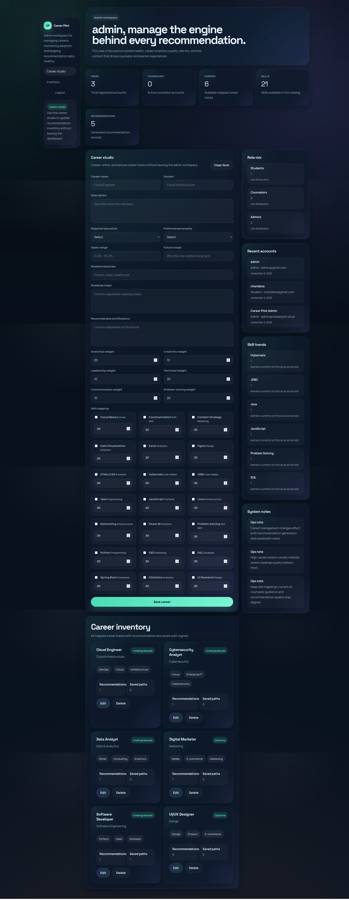

# Career Guidance

Career Guidance is a full-stack career recommendation platform built with Spring Boot, MySQL, JWT security, and a responsive static frontend. It helps students build a profile, complete an assessment, generate AI-assisted career recommendations, review skill gaps, save career paths, and follow learning roadmaps. The same platform also provides separate dashboards for counselors and admins.

The project is designed as a practical academic and portfolio-ready system. It combines role-based access control, structured profile data, assessment scoring, seeded career metadata, and a dataset-driven recommendation layer trained from `data/career_recommender.csv`.

## Project Highlights

- Role-based platform for `Student/User`, `Counselor`, and `Admin`
- Secure authentication using JWT and Spring Security
- Profile-first workflow with skills, interests, goals, and education signals
- Assessment engine for analytical, creativity, leadership, communication, technical, and problem-solving traits
- AI-assisted recommendation engine that blends:
  - profile and skill matching
  - assessment scoring
  - education and personality fit
  - dataset-trained career similarity from historical records
- Recommendation explanations, missing-skill analysis, saved paths, and roadmap guidance
- MySQL persistence for users, profiles, assessments, recommendations, roadmaps, resources, and role dashboards
- Dark, responsive UI built with plain HTML, CSS, and JavaScript

## Screenshots

### Public Pages

| Landing Page | Registration |
| --- | --- |
|  |  |

| Login | Student Dashboard |
| --- | --- |
|  |  |

### Student Experience

| Assessment | Recommendations |
| --- | --- |
|  |  |

### Staff Dashboards

| Counselor Dashboard | Admin Dashboard |
| --- | --- |
|  |  |

## What the Project Does

### 1. Student workflow

The student user creates an account, completes a structured profile, adds interests and skills, takes an assessment, and generates recommendations. The recommendation output includes:

- ranked careers
- compatibility score
- explanation of why the career fits
- matched skills
- missing skills
- learning resources
- roadmap steps
- saved path support

### 2. Counselor workflow

The counselor dashboard shows learner readiness, skill-gap alerts, recent student activity, and emerging career signals. It is designed to help a counselor identify which students need guidance and where common recommendation gaps exist.

### 3. Admin workflow

The admin dashboard manages careers, skills, learning resources, role distribution, system notes, and platform health. Admins can update career data without leaving the workspace.

## Core Functional Areas

### Authentication and authorization

- user registration and login
- JWT token generation and validation
- protected APIs using Spring Security
- role-specific access for student, counselor, and admin routes

### Profile management

- personal and academic details
- interests, strengths, weaknesses
- selected skills
- preferred work type, industry, and long-term goal
- profile completion tracking

### Assessment engine

- default question bank
- weighted answer submission
- trait-wise score calculation
- latest assessment snapshot

### Recommendation engine

- career ranking from current profile and assessment
- explanation generation
- missing-skill analysis
- roadmap and learning-resource attachment
- saved career path support

### Admin and counselor insights

- role mix
- student readiness
- skill trends
- recommendation activity
- career inventory management

## AI and Recommendation Approach

This project uses a hybrid recommendation approach.

### Rule-based matching

The service layer compares the student profile against seeded career data and career skills. It calculates:

- skill match
- interest match
- assessment match
- education match
- personality match

### Dataset-driven matching

The project also reads `data/career_recommender.csv` and trains a lightweight in-app model from historical profile-to-job patterns.

The dataset model:

- reads the CSV at startup
- extracts useful fields such as course, specialization, interests, skills, certifications, CGPA, and masters data
- normalizes noisy job titles into the supported app careers
- builds TF-IDF style text vectors
- measures similarity between the current user profile and learned career prototypes

This learned score is blended with the rule-based score, so the final recommendation remains explainable but also benefits from historical data patterns.

### Supported career labels currently learned from the dataset

- Software Developer
- Data Analyst
- UI/UX Designer
- Cybersecurity Analyst
- Cloud Engineer
- Digital Marketer

## Technology Stack

### Backend

- Java 17
- Spring Boot 3.3.5
- Spring MVC
- Spring Security
- Spring Data JPA
- Hibernate
- JWT
- MySQL

### Frontend

- HTML5
- CSS3
- Vanilla JavaScript

### AI / Recommendation

- custom text-feature extraction
- TF-IDF style vectorization
- cosine similarity scoring
- heuristic career-fit scoring

### Testing

- JUnit 5
- Spring Boot Test
- Mockito
- H2 in-memory database for test isolation

## Dependencies and Why They Are Used

The project dependencies are defined in [pom.xml](/home/javid/Desktop/Documents/Datavalley/MonthlyReports/Projects/java-ai/Career-Guidance/pom.xml).

| Dependency | Purpose |
| --- | --- |
| `spring-boot-starter-web` | Builds REST controllers, JSON APIs, and embedded Tomcat support |
| `spring-boot-starter-security` | Provides authentication, authorization, filter chain support, and password encoding |
| `spring-boot-starter-data-jpa` | Adds repository support, ORM integration, and Hibernate-based persistence |
| `spring-boot-starter-validation` | Validates DTO request payloads using Jakarta Validation |
| `jjwt-api` | Defines JWT interfaces used to create and parse tokens |
| `jjwt-impl` | Runtime JWT implementation |
| `jjwt-jackson` | Serializes and deserializes JWT payload data through Jackson |
| `mysql-connector-j` | Connects the application to MySQL at runtime |
| `h2` | Lightweight in-memory database used for local test runs and isolated test configuration |
| `spring-boot-starter-test` | JUnit, Mockito, Spring test support, and test utilities |
| `spring-boot-maven-plugin` | Runs and packages the Spring Boot application with Maven |

## Skills Used to Build This Project

The project uses a mix of backend, frontend, database, and AI-related skills:

- Java application development
- Spring Boot API design
- Spring Security and JWT authentication
- JPA entity modeling and relational database design
- MySQL configuration and persistence
- HTML, CSS, and responsive UI design
- JavaScript DOM rendering and API integration
- role-based access control
- dataset cleaning and text normalization
- recommendation-system design
- automated testing with JUnit and Mockito

## Project Structure

```text
src/main/java/com/datavalley/careerguidance
├── ai
├── config
├── controller
├── dto
├── entity
├── exception
├── repository
├── security
└── service

src/main/resources
├── application.properties
├── application-mysql.properties
└── static

data
└── career_recommender.csv

screenshots
└── *.png
```

### Package summary

- `ai`  
  Contains the hybrid recommendation engine and dataset model.

- `config`  
  Contains Spring Security configuration and initial data seeding.

- `controller`  
  Exposes REST endpoints for auth, profile, assessment, recommendations, careers, admin, and counselor features.

- `dto`  
  Defines request and response payloads.

- `entity`  
  Defines the JPA domain model and database tables.

- `repository`  
  Contains Spring Data repository interfaces.

- `security`  
  Contains JWT service, auth filter, and custom user details service.

- `service`  
  Contains business logic for auth, profiles, careers, assessment, workspaces, and recommendations.

## Main Entities Stored in the Database

The application persists its data through JPA entities and MySQL tables. Important entities include:

- `User`
- `UserProfile`
- `Skill`
- `UserSkill`
- `AssessmentQuestion`
- `AssessmentResult`
- `Career`
- `CareerSkill`
- `LearningResource`
- `Recommendation`
- `SavedCareer`

This means MySQL stores the complete operational data of the project, including:

- registered accounts
- roles
- profile details
- selected skills
- assessments
- recommendations
- saved paths
- career definitions
- roadmap steps
- learning resources

## Requirements

To run this project locally, you need:

- Java 17 or later
- Maven 3.9 or later
- MySQL 8.x
- a browser for the static UI

Optional but useful:

- IntelliJ IDEA or VS Code
- MySQL Workbench
- Postman or Insomnia for API testing

## Database Setup

The application is configured to run on MySQL by default.

### Current local defaults

- host: `127.0.0.1`
- port: `3306`
- database: `career_guidance`
- username: `root`
- password: `Javid@123`

### Create the database manually if needed

```sql
CREATE DATABASE IF NOT EXISTS career_guidance
CHARACTER SET utf8mb4
COLLATE utf8mb4_unicode_ci;
```

### Override with environment variables

You can change the local database connection without editing source code:

```bash
export APP_DB_HOST=127.0.0.1
export APP_DB_PORT=3306
export APP_DB_NAME=career_guidance
export APP_DB_USERNAME=root
export APP_DB_PASSWORD=your_mysql_password
```

Or provide a full JDBC URL:

```bash
export APP_DATASOURCE_URL='jdbc:mysql://127.0.0.1:3306/career_guidance?createDatabaseIfNotExist=true&useSSL=false&allowPublicKeyRetrieval=true&serverTimezone=UTC'
export APP_DB_USERNAME=root
export APP_DB_PASSWORD=your_mysql_password
```

### Important note

The current local credentials are suitable only for development. They should be changed before any shared or production deployment.

## How to Run the Project

### 1. Build the project

```bash
mvn clean compile
```

### 2. Start the application

```bash
mvn spring-boot:run
```

### 3. Open the UI

- `http://localhost:8080/`
- `http://localhost:8080/login.html`
- `http://localhost:8080/register.html`
- `http://localhost:8080/dashboard.html`

## Default Admin Account

The seed configuration creates one admin account automatically.

- email: `admin@careerpilot.local`
- password: `Admin@123`

You can create additional student and counselor accounts from the registration page.

## Important API Endpoints

### Authentication

- `POST /api/auth/register`
- `POST /api/auth/login`

### Profile and skills

- `GET /api/skills`
- `GET /api/profile/me`
- `PUT /api/profile/me`

### Assessment

- `GET /api/assessments/default/questions`
- `POST /api/assessments/default/submit`
- `GET /api/assessments/results/latest`

### Recommendations and saved paths

- `GET /api/recommendations/me`
- `POST /api/recommendations/generate`
- `GET /api/recommendations/saved`
- `POST /api/careers/{id}/save`

### Careers

- `GET /api/careers`
- `GET /api/careers/{id}`
- `GET /api/careers/{id}/resources`

### Counselor

- `GET /api/counselor/overview`

### Admin

- `GET /api/admin/overview`
- `POST /api/admin/careers`
- `PUT /api/admin/careers/{id}`
- `DELETE /api/admin/careers/{id}`

## Security Model

The application uses JWT-based stateless security.

### Public routes

- landing page
- login page
- registration page
- static CSS and JavaScript assets
- authentication endpoints
- public skill and career reads

### Student-only routes

- profile APIs
- assessment APIs
- recommendation APIs
- save career path action

### Counselor-only routes

- counselor overview APIs

### Admin-only routes

- admin overview APIs
- career management APIs

## Recommendation Flow

The recommendation process follows this order:

1. The user registers and logs in.
2. The user completes profile data and adds skills.
3. The user submits the trait-based assessment.
4. The recommendation engine loads:
   - profile data
   - selected skills
   - latest assessment
   - career metadata
   - dataset-trained career signals
5. The service ranks careers and stores the results.
6. The frontend renders explanations, skill gaps, resources, and roadmaps.
7. The user can save career paths for later review.

## Seeded Data Included

The application includes seed data for:

- admin account
- core skills
- multiple careers
- career-skill mappings
- learning resources
- assessment questions

This makes the system usable immediately after startup without requiring manual admin setup.

## Testing

Run the automated tests with:

```bash
mvn test
```

Test configuration uses H2 instead of MySQL so the suite can run in isolation.

Current test coverage includes:

- JWT filter behaviour
- auth service role registration
- dataset-model loading and scoring

## Notes for Improvement

This project is already a strong base for a production-style student guidance system, but some next steps would improve it further:

- add password reset and email verification
- expand the career catalog and dataset label mapping
- add database migrations with Flyway or Liquibase
- add pagination and filtering for admin and counselor views
- expose recommendation history and audit trails
- add API documentation using OpenAPI or Swagger
- improve test coverage for controllers and services

## Summary

Career Guidance is a complete role-based web application for career planning. It combines backend security, database persistence, responsive UI design, and a practical recommendation engine. The project demonstrates real software engineering skills across API development, frontend integration, database design, and lightweight AI-based recommendation logic.
